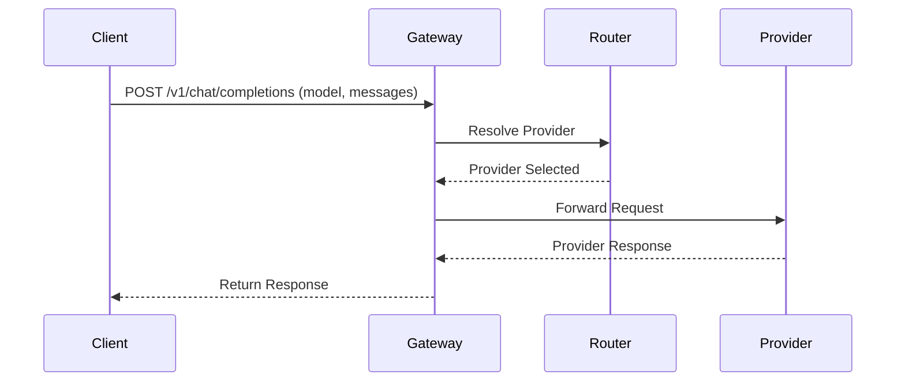

# LLM Relay

A self-hosted, multi-provider LLM gateway with semantic caching, token-aware rate limiting, and cost tracking.


## What is LLM Relay?

LLM Relay is a unified API proxy that sits between your applications and various Large Language Model (LLM) providers like OpenAI, Anthropic, and local instances like Ollama. 

By exposing a single, standard OpenAI-compatible API endpoint, it allows you to normalize interactions across different backend models. This effectively eliminates vendor lock-in, as you can switch underlying providers by updating a configuration file without modifying your application code.

Furthermore, LLM Relay augments the raw provider APIs with essential gateway features. It introduces token-aware rate limiting, retry and fallback mechanisms, cost tracking, and a semantic cache. These features ensure greater reliability, observability, and control over LLM usage and expenses.

## Features

| Feature | Status |
|---------|--------|
| OpenAI-compatible API endpoint | ✅ |
| Multi-provider routing (OpenAI, Ollama) | ✅ |
| SSE streaming passthrough | ✅ |
| Configurable model-to-provider mapping | ✅ |
| Graceful shutdown | ✅ |
| Anthropic provider | 🔜 |
| Retry with backoff + fallback | 🔜 |
| Circuit breaker | 🔜 |
| Redis-backed token-bucket rate limiting | 🔜 |
| Semantic response cache (hand-built HNSW index) | 🔜 |
| Usage & cost tracking (PostgreSQL) | 🔜 |
| Prometheus metrics | 🔜 |

## Architecture

```
Client → Gateway → [Auth] → [Rate Limit] → [Cache] → Router → Provider → Response
```

- **Client**: Any application using an OpenAI SDK or making HTTP requests.
- **Gateway**: The core proxy that processes incoming requests.
- **Auth**: Validates API keys and retrieves token budgets.
- **Rate Limit**: Controls request volume using a Redis-backed token bucket algorithm.
- **Cache**: A semantic cache checking an HNSW index for similar previous queries to save costs.
- **Router**: Directs requests to the appropriate provider based on the model map or default settings.
- **Provider**: The target LLM service (OpenAI, Ollama, Anthropic).

### Request Flow Diagram



## Quick Start

### Prerequisites
- Go 1.22+
- Docker & Docker Compose
- Ollama with a model pulled (e.g., `llama3.2`)

### 1. Clone and Build
```bash
git clone https://github.com/Divyanshu-yadav-18/llm_relay.git
cd llm_relay
go build -o gateway ./cmd/gateway
```

### 2. Start with Ollama (Simplest path)
Ollama requires no API keys, making it ideal for quick local testing. Ensure Ollama is running and has the `llama3.2` model downloaded.

```bash
./gateway --config configs/gateway.yaml
```

### 3. Test with curl

**Non-streaming:**
```bash
curl http://localhost:8080/v1/chat/completions \
  -H "Content-Type: application/json" \
  -d '{
    "model": "llama3.2",
    "messages": [{"role": "user", "content": "Hello!"}]
  }'
```

**Streaming:**
```bash
curl http://localhost:8080/v1/chat/completions \
  -H "Content-Type: application/json" \
  -N \
  -d '{
    "model": "llama3.2",
    "messages": [{"role": "user", "content": "Hello!"}],
    "stream": true
  }'
```

### 4. Start with Docker Compose
For a complete environment including Redis and PostgreSQL (for future features), use Docker Compose:
```bash
docker-compose -f deploy/docker-compose.yml up --build
```

## Configuration

The gateway is configured via `gateway.yaml`. Environment variables can be injected using the `${ENV_VAR}` syntax.

```yaml
providers:
  openai:
    base_url: https://api.openai.com/v1
    api_key: ${OPENAI_API_KEY}
    models:
      - gpt-4o
      - gpt-3.5-turbo
  ollama:
    base_url: http://localhost:11434
    api_key: ""
    models:
      - llama3.2

routing:
  default_provider: ollama
  model_map:
    gpt-4o: openai
    llama3.2: ollama
```

- **Add a new provider:** Define it under `providers` with its URL, API key, and supported models.
- **Map models to providers:** Update `routing.model_map` to explicitly tie a model name to a provider.
- **Set the default provider:** The `routing.default_provider` is used if the model is not mapped.
- **Environment variables:** Store secrets in environment variables and reference them (e.g., `${OPENAI_API_KEY}`).

## Project Structure

- `cmd/gateway/main.go` - The entry point of the gateway application.
- `internal/config/` - Handles loading, expanding, and validating YAML configuration.
- `internal/providers/` - Defines the `Provider` interface and models for requests/responses.
- `internal/providers/openai/` - OpenAI provider implementation.
- `internal/providers/ollama/` - Ollama provider implementation.
- `internal/proxy/` - Streaming and proxy logic, managing SSE passthrough.
- `configs/gateway.yaml` - The main configuration file.
- `deploy/` - Dockerfile and docker-compose definitions.
- `migrations/` - SQL schemas for PostgreSQL setup.

## Development

- **Run locally:** `go run ./cmd/gateway --config configs/gateway.yaml`
- **Run tests:** `go test -v -race ./...`
- **Build Docker Image:** `docker build -t llm_relay -f deploy/Dockerfile .`

## Roadmap

- **Phase 1 (Current):** Basic proxy, multi-provider routing, SSE streaming.
- **Phase 2:** Multi-provider routing enhancements and resilience (retries, circuit breakers).
- **Phase 3:** Token-aware rate limiting using Redis.
- **Phase 4:** Authentication and database usage tracking (PostgreSQL).
- **Phase 5-6:** Semantic caching with a custom HNSW index to reduce costs on similar queries.
- **Phase 7:** Comprehensive observability and Prometheus metrics.

## License

MIT License.
