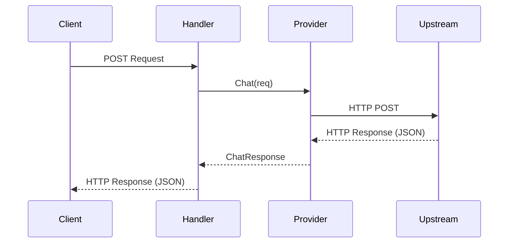
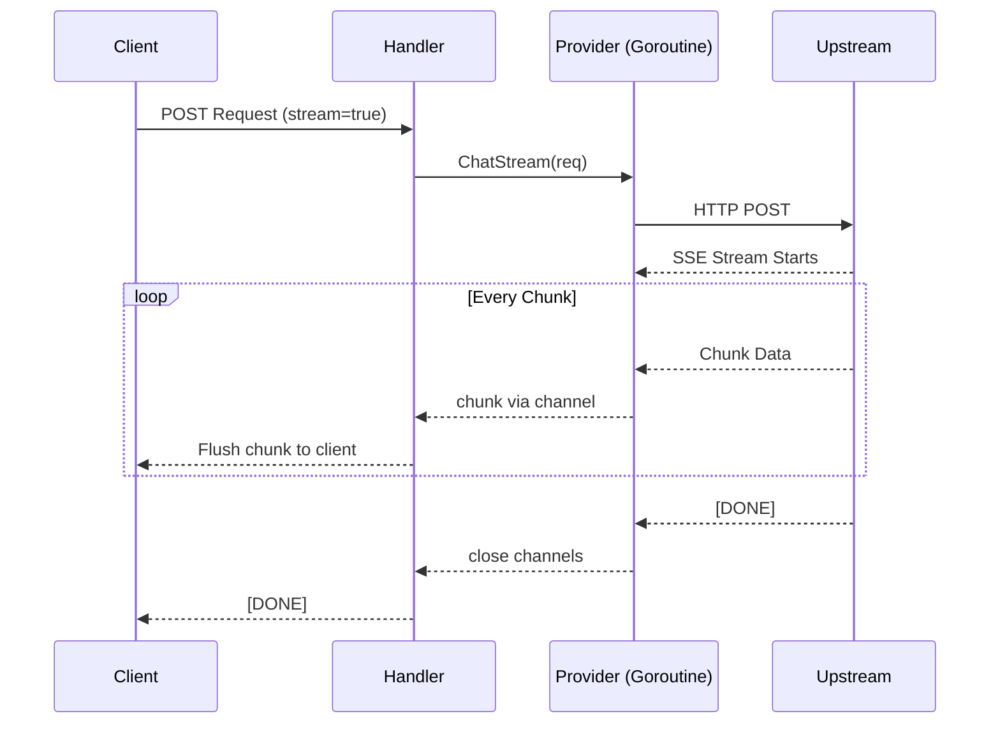

# Architecture

## Design Philosophy

- **Why Go:** Go's lightweight concurrency model (goroutines) makes it the ideal choice for an IO-bound proxy, particularly for handling long-lived Streaming Server-Sent Events (SSE) connections with minimal overhead. It aligns well with backend gateway development and provides strong typing for API structures.
- **Why OpenAI-compatible API:** The OpenAI API format has become the de facto standard in the LLM ecosystem. By adhering to this format, LLM Relay acts as a drop-in replacement. Any application using official OpenAI SDKs or standard HTTP clients can immediately interface with the gateway without modification.
- **Why chi router:** The `chi` router is lightweight, idiomatic, and highly composable. It avoids reflection-heavy magic, keeping the request pipeline fast and predictable, while providing excellent middleware support.

## Component Deep Dives

### Provider Abstraction

The `Provider` interface is the fundamental abstraction of LLM Relay, allowing the gateway to treat diverse backend models uniformly:

```go
type Provider interface {
	Name() string
	Chat(ctx context.Context, req *ChatRequest) (*ChatResponse, error)
	ChatStream(ctx context.Context, req *ChatRequest) (<-chan StreamChunk, <-chan error, error)
	Models() []string
}
```

- Providers are registered dynamically based on the configuration file during startup.
- The `ChatRequest` and `ChatResponse` structs directly mirror OpenAI's JSON schemas.
- `ProviderError` encapsulates the underlying error, HTTP status code, and crucially, a `Retryable` flag, providing the resilience layer with context on whether to back off and retry (e.g., on a 429 Too Many Requests) or fail immediately.

### SSE Streaming

Streaming is critical for LLM applications. Waiting for a complete response (Total Latency) degrades user experience; streaming provides a fast Time To First Token (TTFT).

- The gateway proxies Server-Sent Events (SSE) without buffering.
- **Concurrency Pattern:** The provider implementation launches a goroutine to read the upstream stream, decoding events and pushing them into a `<-chan StreamChunk`. 
- The HTTP handler reads from this channel and immediately flushes the data to the client.
- The error channel (`<-chan error`) is buffered (size 1) to prevent goroutine leaks if the client disconnects prematurely or the context cancels before the error can be read.
- **Flusher Interface:** Standard Go `http.Flusher` is used to push chunks. The `X-Accel-Buffering: no` header is explicitly set to instruct upstream reverse proxies (like Nginx) not to buffer the streaming chunks, ensuring low-latency delivery.

### Configuration System

LLM Relay utilizes a YAML-based configuration designed for operational simplicity.
- The load pipeline: parse YAML → expand environment variables → set sane defaults → validate.
- Expanding environment variables natively allows storing sensitive data (like API keys) securely in the environment, adhering to 12-factor app principles and remaining Docker-friendly.

### Request Routing (Phase 1 — Current)

The routing engine resolves the target provider through a hierarchical chain:
1. **Explicit Provider:** The `ChatRequest` includes an optional custom `provider` field. If specified, this overrides all defaults (useful for targeted testing and debugging).
2. **Model Map:** If no explicit provider is requested, the system looks up `req.Model` in the `routing.model_map`.
3. **Default Provider:** If the model is not mapped, the request falls back to `routing.default_provider`.

## Data Flow

### 1. Non-streaming Request (Synchronous Path)



### 2. Streaming Request (Goroutine + Channel Path)



## Database Schema

The database provides auditing, tracking, and cost management.

- **`api_keys` Table:** Uses `UUID` for primary keys to ensure key uniqueness and prevent enumeration. The `key_hash` stores the securely hashed token, while `key_prefix` (e.g., `sk-a1b2`) is stored in plaintext to allow users to identify their keys without exposing the full secret.
- **`usage_logs` Table:** Uses a `BIGSERIAL` primary key due to the expected high volume of individual log entries. It tracks token usage (`prompt_tokens`, `completion_tokens`), calculated `cost_usd`, and performance metrics (`latency_ms`) to enable detailed analytics.

## Future Architecture

- **Resilience:** Will wrap the `Provider` interface using the decorator pattern. Retries and circuit breaking will transparently occur without altering the core provider logic.
- **Rate Limiter:** Implemented as HTTP middleware intercepting requests early in the chain.
- **Cache:** Positioned between the rate limiter and the router. It will intercept requests, perform an embedding lookup on the semantic index, and short-circuit the router if a high-confidence match is found.
- **Usage Logger:** To prevent logging from impacting latency, usage tracking will be asynchronous, writing metrics to a buffered channel consumed by a background PostgreSQL writer worker.
